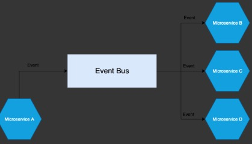
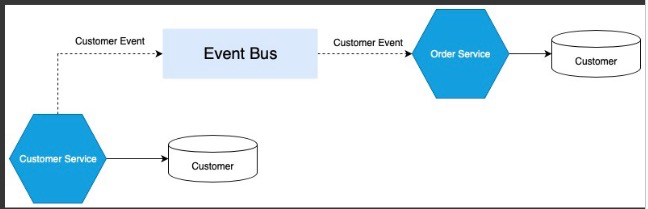
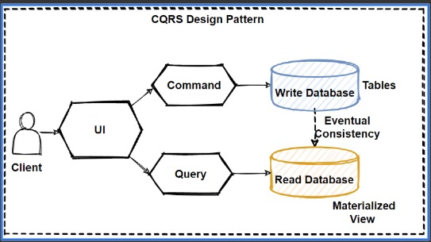
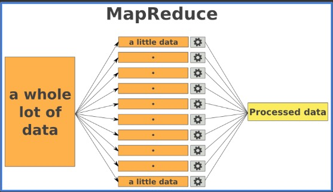

# Highload Applications Architecture

There are two classes of problems in HA

- **Single point of Failure (SPOF)** is a part of a system that, if it fails, will stop the entire system from working. SPOFs are undesirable in any system with a goal of high availability or reliability.
- **Bottleneks** occurs when the capacity of an application or a computer system is severely limited by a single component. It has lowest throughput of all parts of the transaction path.

**Main Principles**

- `Reliability` we don't want that our system fails on every 2-d request
- `Scalability` it is guaranteed that system can handle any load
- `Efficiency` we want to be cost effective, and don't spend all money
- `Performance` system should quickly respond to client's requests

**Simplicity is a key**

It is better to have a bunch of simple components in the system. Simple things are easier to understand, analyze, improve, replace. Look at SOLID. S there stands exactly for that - `Single Responsibility Principle`.

**Proper Approach**

- Always keep in mind what is your `main goal`
- Start with `simplest` solution
- Continuosly look for `bottlenecks` and `SPOF`s - improve first and avoid second
- Split complex things into `simple` ones

[`Example Architecture of highload systems`](https://github.com/donnemartin/system-design-primer?tab=readme-ov-file#design-pastebincom-or-bitly)

## Architecture patterns

### Load Balancer

This pattern is used to distribute incoming traffic evenly across multiple servers to prevent overload and improve the system's overall performance. Load balancing patterns can be applied at different levels, including network, transport, application, and database.

### N Tier

This pattern involves dividing an application into separate tiers, each responsible for a different aspect of the application, making it easier to scale and manage.

### Event Notification

Is a pattern in which a system sends an event in order to notify other systems of a change. A defining feature of this architecture is that `the system doesn't expect a response from the event at all`. There should be a separation between the logic that sends the event and any logic that get triggered by it. This pattern is handy because it makes a lower level of coupling simple.

`Important:` We need to be sure that our listeners don't know anything about each other, and won't comunicate with each other via tons of http calls. They should know only about the events in event bus.

### Event-carried State Transfer

The event-carried state transfer pattern is very similar to the event notification pattern. It often shows up when you're looking for less communication between systems. This is achieved by duplicating data across multiple systems.

Advantages:

- Easy to decouple systems;
- Reduced number of network calls;

Disadvantages

- Consumer complexity handling state;
- Eventual consistency;
- Duplicated data;

### Event Sourcing

This pattern is less commonly used but the main idea of event sourcing all changes to a systems state is recorded as an event. You should be able to `recreate the current state by replaying all previous events`. This is a fundamentally different way of looking at a system because the event store is the `source of truth`, not the database. A commonly used example for describing this pattern is a version control system like git where each commit is an event.

Advantages

- Reproducibility makes debugging easy;
- Data analysis of Event Streams;
- Auditing is built in;

Disadvantage:

- Takes getting used to;
- Much less support;

### CQRS

(Command Query Responsibility Segregation) Pattern: This pattern separates `read` and `write` operations, allowing for the scaling and optimization of each independently.

### Map-Reduce

This pattern is commonly used in big data processing and involves splitting large data sets into smaller chunks, processing them independently, and then combining the results.
The idea that each worker takes chunk of data which he interested in from one big source, procceed and put result into general source.
`Examples`: Google Analytics, Hadoop

### Microservices

It is a variant of the service-oriented architecture (`SOA`) architectural style that structures an application as a `collection` of `loosely coupled services`. In a microservices architecture, services are fine-grained and the protocols are lightweight.

This pattern involves breaking down large applications into smaller, independently deployable and manageable services that can scale and adapt to changing demands.

Advantages:

- Easy and frequent deployment;
- Independent scalability;
- Independent technology stacks;
- Independence in case of failure

Disadvantages:

- Increased effort for operations, deployment and monitoring;
- Performance hit due to HTTP, (de)serialization (and network) overhead;

## More Info

- `http://highscalability.com`
- [Reactive Microservices](https://drive.google.com/file/d/1A0-Rs3AID9S9IGOBAFnK1x3fD0podnSM/view?usp=sharing)
- [Scalable Design Patterns](http://horicky.blogspot.com/2010/10/scalable-system-design-patterns.html)
- [**Design Primer**](https://github.com/donnemartin/system-design-primer)
- [Architecture Diagrams for AWS](https://aws.amazon.com/architecture/?nc1=h_ls&cards-all.sort-by=item.additionalFields.sortDate&cards-all.sort-order=desc&awsf.content-type=content-type%23reference-arch-diagram&awsf.methodology=*all&awsf.tech-category=*all&awsf.industries=*all&awsf.business-category=*all)
- [Architecture Diagrams for Azure](https://learn.microsoft.com/en-us/azure/architecture/browse/)
