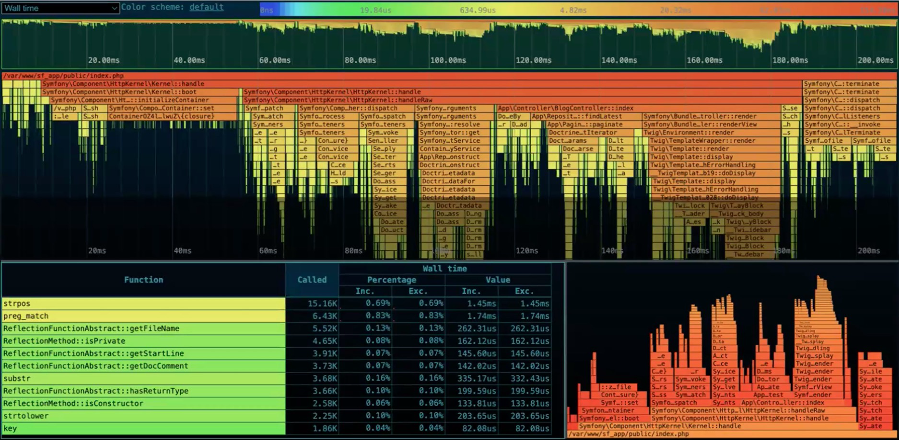
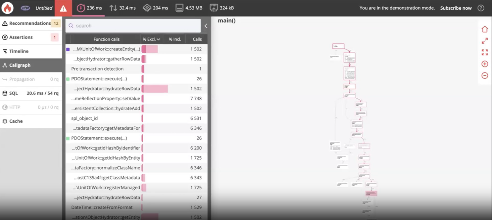

# Profiling

is a form of dynamic program analysis that measures, for example, the space (memory) or time complexity of a program, the usage of particular instructions, or the `frequency and duration of function calls`. Most commonly, profiling information serves to aid program optimization.

## Kinds of Profilers

- [Flat Profiler](#fp-definition)
- [Call-Graph Profiler](#cgp-definition)
- [Input Sensitive Profiler](#input-sensitive-profilers)

### FP Definition

A `Flat Profiler` is a type of performance analysis tool that focuses on providing insights into the resource consumption at a function-level granularity. Unlike call-graph profilers, which track the call hierarchy between functions, flat profilers accumulate data directly from individual functions. This allows developers to quickly identify which functions consume the most resources, making it an essential tool for performance optimization.

**Key Characteristics**

- `Function-Level Granularity`: Flat profilers provide information about individual functions, including metrics like execution time, number of calls, and resource consumption.
- `Simplicity and Speed`: They are typically faster and less resource-intensive compared to call-graph profilers, making them suitable for quickly identifying performance bottlenecks.
- `Aggregate Statistics`: Flat profilers present aggregated statistics, allowing developers to focus on functions that have the most significant impact on performance

**What can analyze?**

- `Execution time`. This metric indicates how much time is spent executing a specific function. Functions with long execution times are potential candidates for optimization.
- `Resource Consumption`. Flat profilers also provide information about resource utilization, such as CPU usage, memory usage, and I/O operations. This helps in identifying functions that are particularly resource-intensive.

**FP use cases**

- `Identifying Performance Hotspots`. Flat profilers excel at quickly pinpointing functions that contribute significantly to overall execution time or resource consumption.
- `Optimizing Critical Sections`. In applications where certain functions are performance-critical, flat profilers can help fine-tune these sections for maximum efficiency.
- `Prioritizing Optimization Efforts`. By focusing on the functions with the highest resource consumption, developers can prioritize optimization efforts for the greatest impact.

**FP Limitations**

- `Lack of Call Context`. Unlike call-graph profilers, flat profilers do not provide information about the call hierarchy. This means they may not capture the complete picture of how functions interact with each other.
- `Limited Insight into Control Flow`. Flat profilers don't show how control flows between functions. This can be a limitation when trying to understand the overall flow of the program.
- `Potential for Misleading Results`. In some cases, functions with high resource consumption may not be the actual bottleneck. This can happen if a function is called frequently but executes quickly.

**FP Best Practices**

- `Profile Representative Workloads`. Ensure that the workload used for profiling is representative of real-world usage scenarios. This ensures that the profiling results are relevant.
- `Combine with Other Profiling Techniques`. Flat profilers are most effective when used in conjunction with other types of profilers, such as call-graph or memory profilers, to get a comprehensive view of performance.
- `Iterative Profiling`. Perform multiple profiling runs, making incremental changes to the code between runs. This helps track the impact of optimizations.
- `Focus on Top Contributors`. Prioritize optimization efforts on the functions that have the most significant impact on performance.

### CGP Definition

`Call-graph profilers` are performance analysis tools that provide insights into the `call hierarchy` of functions within a program. Unlike flat profilers, which focus on individual functions, call-graph profilers trace the flow of function calls, showing how functions interact with each other. This allows developers to understand the broader context of function execution and identify critical paths.

**CGP Key Characteristics**

- `Call Hierarchy Visualization`. Call-graph profilers generate visual representations of the call hierarchy, illustrating which functions call others.
- `Contextual Understanding`. They provide a contextual understanding of how functions are related and interact during program execution.
- `Overhead`. Call-graph profilers typically have higher overhead compared to flat profilers, as they need to instrument function calls.

**CGP What can I analyze?**

- `Critical Path Analysis`. They identify the sequence of function calls that contribute the most to overall execution time.
- `Call Frequencies`. Call-graph profilers track how often each function is called, giving insights into the flow of program execution.
- `Nested Call Analysis`. They highlight nested calls, showing functions that are invoked within other functions.

**CGP Use Cases**

- `Identifying Bottlenecks in Function Interactions`.
- `Optimizing Algorithmic Complexity`. They help in identifying and optimizing complex call patterns that may lead to inefficiencies.
- `Understanding Code Flow`. Call-graph profilers are invaluable for comprehending the flow of execution in a program.

**CGP Limitations**

- `Higher Overhead`. Due to the need to instrument function calls, call-graph profilers can have a higher performance overhead compared to flat profilers.
- `Complex Output`. The visual representation of call graphs can become complex, especially for large and intricate programs.
- `Less Granular than Flat Profilers`. While excellent for understanding call flow, call-graph profilers may not provide the same level of detail on individual function performance as flat profilers.

**CGP Best Practices**

- `Focus on Critical Paths`. Use call-graph profilers to identify and optimize the critical paths in your code where function interactions have the most impact on performance.
- `Aggregate Statistics`. Look for aggregated statistics that highlight functions with high call frequencies and deep call hierarchies.
- `Combine with Flat Profilers`. For a comprehensive performance analysis, consider using both flat and call-graph profilers in conjunction.
- `Visualize and Interpret`. Leverage the visual representation of call graphs to gain insights into the structure of your program and identify areas for improvement.

**Important:** Due to higher perfomance overhead compared to flat profiles. We `shouldn't use them on the production environment` with real clients request. Instead we should detect the problem on the production with use of `Flat Profiler`, and then, to validate and get more detailed context of the issue, run `Call Graph Profiler` on the stagging to collect snapshot.

### Input-Sensitive Profilers

`Input-sensitive profilers` are specialized `performance analysis` tools that take into account `variations in input data` when profiling a program. Unlike traditional profilers, which provide insights based on a fixed input, input-sensitive profilers analyze performance under different scenarios, such as varying input sizes or data distributions. This allows developers to understand how program performance scales with different inputs.

One of the commong use case for this type of profiles `are measuring and validating the asymptothink curve of the algorithm`. In some critical mission applications we must be sure that the critical algorithm of search/sorting/filtering etc. works in predefined Big O time. For example `system does some heavy computational search and we'he defined that the complexity of this algorithm can't be bigger then nLogn`, we must include the Input-Sensitive profiler into our `CI/CD pipeline previusly build the representative set of data which will be used by IS Profiler`, and as a result we will be able to verify our Big O.

**Important**: Input sensitive profiler can't be run on the production

**ISP Limitations**

- `Increased Analysis Overhead`. Analyzing multiple input scenarios can increase the overhead of profiling, potentially making it more time-consuming. -`Need for Representative Scenarios`. The effectiveness of input-sensitive profilers depends on selecting input scenarios that accurately represent real-world usage patterns.
- `Limited to Synthetic Data`. In cases where real-world data is not readily available, generating representative synthetic data may be challenging.

**ISP Best Practices**

- `Select Representative Scenarios`. Choose input scenarios that closely mirror real-world usage patterns to ensure accurate profiling results.
- `Automate Scenario Generation`. If possible, automate the process of generating different input scenarios to streamline the profiling process.
- `Analyze Scaling Behavior`. Focus on understanding how the program's performance scales with different input sizes to identify potential scalability bottlenecks.

## Advantages/Disadvantages

- `Advantages`. You can see full trace of your application, observe variables on every step, look at memory and space consumption at every specific moment of execution
- `Disadvantages`. Smart profiler slow down your application a lot and sometimes eat more resources than application itself.

## Examples

- `Xdebug` - heavy, don’t recommend to use on production, big overhead
- `Blackfire.io` - initially fork of xhprof, lightweight, nice GUI, can be used on production
- [`APROF`](https://github.com/ercoppa/aprof/wiki)
