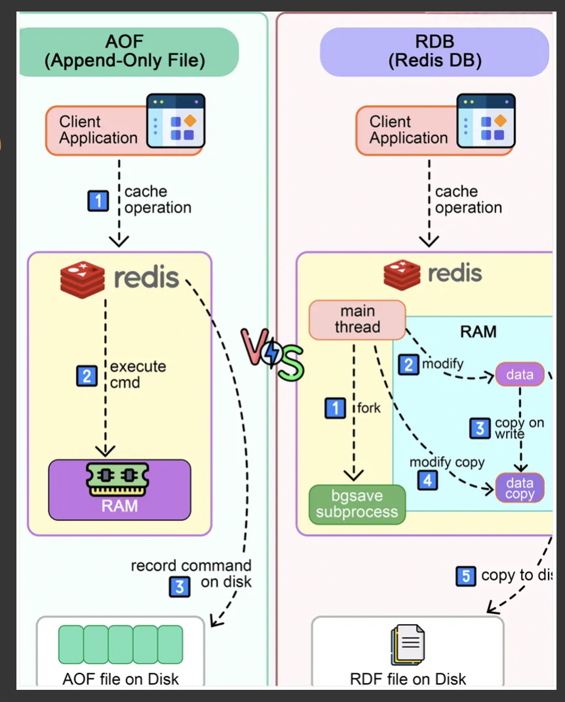

# Redis 

Redis (Remote Dictionary Server) is an in-memory, distributed, key-value database with optional durability. Redis supports different kinds of abstract data structures, such as strings, lists, maps, sets, sorted sets, HyperLogLogs, bitmaps, streams, and spatial indexes.

## Benchmark 
Redis has built-in tool for benchmarking.
`redis-benchmark -q -n 100000 -c 50 -P 10`

**-q** - quiet mode;
**-n** - amount of requests;
**-c** - parallel clients (concurrency);
**-P** - number of requests in pipeline;  

Number of requests in pipeline can play a crucial role in perfomance. With use of pipeline queries, we avoid the need to oppen new connection for each operation. 

## Data Persistance 

In Redis we have two persistence modes: **RDB** and **AOF**.



### RDB 

Redis snapshotting is the simplest Redis persistence mode (and it’s used by default). It produces point-in-time snapshots of the dataset when specific conditions are met. This conditions can be controlled by the user configuring the Redis instance, and can also be modified at runtime without restarting the server. 

Note please, that RDB snapshots are also used by Redis when performing a **master-slave synchronization**.

This approach is efficient, because the proccess of reading from rdb snapshot and sync in RAM on instance reboot is relativelly fast operation.

The main disatvantage of this approach is that snapshots is storing in memory before sync to disk. And with more frequent snapshots, amount of situations when Redis RAM usage increase by x2 db size will be growing. When snapshot won't fit into RAM, Swap will be used and systems will became much slower.

#### RDB Config
```
# Default Params 
save 900 1 # sync every 900 seconds if at least 1 record exists
save 300 10 # sync every 300 seconds if at least 10 record exists
save 60 10000 # sync every 60 seconds if at least 10000 record exists

dir /var/redis/	# Dir with dump 
dbfilename dump.rdb	# File name
rdbcompression yes	# Compression usage

For max performance turn off all persistence by commenting all save directives
```
 
### AOF 
The Append Only File, usually called simply AOF, is the main Redis persistence option. The way it works is extremely simple: every time a write operation that modifies the dataset in memory is performed, the operation gets logged. The log is produced exactly in the same format used by clients to communicate with Redis, so the AOF can be even piped via netcat to another instance, or easily parsed if needed. At restart Redis re-plays all the operations to reconstruct the dataset.

**Adventeges:** We will never get x2 memory usage, as we could get with RDB. 
**Disadventeges:** Every new operation will be sync to disk, so with big amount of opearations amount of I/O operations will grow significantlly. And in result Redis perfomance will be slowned down. Isn't a good fit for write heavy systems. **On instance reboot, if amount of operations is large, more time will be taken to start instance.**

To minimize the amount of operations to sync operations from RAM to disk. There is an option in redis config, **appendfsync**.  
Note: with AOF we are syncing operations not the data as we do with RDB.  

Good solution will be to setup both RDB and AOF. For example we can configure RDB to make a snapshot once per day, and AOF mode to sync more frequently. With this approach on system reboot, firstly data from RDB will be sync from the disk and only then will be synced operations from AOF. 

Without AOF isn't possible to build cluster. 

#### AOF Configuration
```
appendonly yes
appendfilename "appendonly.aof" # The name of the append only file (default: "appendonly.aof")
appendfsync everysec
```

