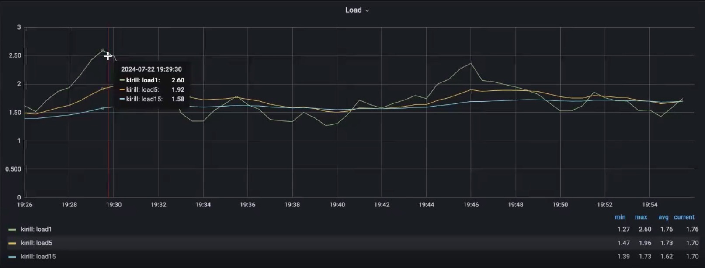
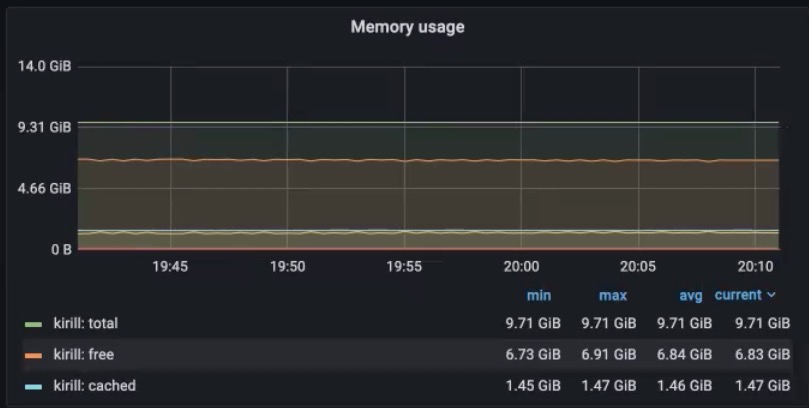
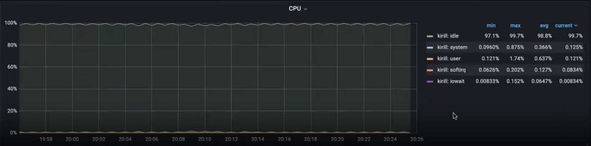

# Resource Monitoring Systems

## Metrics

First of all we will review the general metrics of the hardware. All metrics below pretty common and should be treated in the same way on different projects.

### Load Average

**LA** is a measure of the amount of computational work that a computer system performs. The load average represents the average system load over a period of time. [Details](https://medium.com/coinmonks/decoding-load-average-in-linux-cdc98b30e0c6)

**Normal value of it**: when it is less than amount of CPU cores

LA grows when the amount of waiting proccessors is bigger then the amount which can be procceed by CPU in a time frame (1/100th second).

**The BALANCE state** when the LA value is <= the amount of CPU cores.

- 8 core CPU, load average is 8 (good)
- 4 core CPU, load average is 8 (bad)

When load1 is much bigger then load15 it means that load average is growing, and vice versa.

### RAM Usage and SWAP Usage

- One of the oldest way of perfomance boosting is to sync data from hard drive to memory. It gives high boost in productivity, but there is a risk of losting data,because RAM is not temporary storage.
- Running out of RAM indicates that the server is under severe load and application performance will almost certainly be noticeable to end users.
- When available RAM is short or totally maxed out, Linux moves data from RAM to SWAP. High SWAP usage means that you don’t have enough RAM

One of the biggest risk with RAM is noticable degradade of perfomance. It happens when we run out of RAM, and starting using SWAP.When SWAP will run out, the machine might reboot.

### Disk Space

Track current disk space used versus the total disk space on the server’s hard drives, as well as the total inodes available on the drives.

Bad Example of disk usage: write lot's of logs to the disk.

- Case: MySQL slow query configured with threshold:0, as a result each row will be written to the disk independently. Which can degradate the perfomance because the proccess of writting to the disk is slow.

### CPU

If the CPU usage goes to 100% for all cores, then your server is thinking too hard about something. Usually when this happens for an extended period of time, your end users will notice poor performance and response times. Sites hosted on the server might become unresponsive or extremely slow.

- **idle** - idle task - when nothing to do.
- **user** - the percentage of CPU usage of the current system user.
- **system** - the percentage of CPU usage of the system (ideally not biggger then 5%).
- **iowait** - idle, while system making disk I/O request. The picks of this metric indicates the shortage in perfomance of hard. drive. Either we run out RAM and started working with a SWAP or we reach the limit of allowed allowed I/O operations to hard drive. When Disk I/O request metric is increasing it means that we rich the limit of allowed I/O operations to hard drive.
- **steal** - virtual CPU waits for a real CPU while the hypervisor is servicing another virtual processor. The easiest and efficient way of fixing high steal is to force the restard of virtual machine. (be sure that VM is state less and replication is configured). Good state when it is <= 2%.
- **softirq** - software interrupts. Meric indicates how much resources and time cpu use to swith the context. Ussually it is the slowest metric value.
- **nice** - users' processes that have been "niced".
  

## Monitoring Systems

[Example repo]()
Why we need them? **1**.Because we want to sleep well; **2**.We want to track and predict the future load based on metrics;
**Caution:** we can collect both system and product metrics, with system below
Such systems composed of 3 components

### Agent

Software for collecting and reporting metrics and events. One agent per each physical machine,target.(docker socket setup to read data from all containers). Agent is pushing data to storage.

- [`Telegraf`](https://www.influxdata.com/time-series-platform/telegraf/)
- [`Elastic beats`](https://www.elastic.co/beats)
  Telegraf config params: hostname, flush_interval, interval, metric_buffer_limit

### Storage

Database with metrics and events. Run on seperate server from dashboard and agent.

- [`InfluxDB`](https://www.influxdata.com/products/influxdb-overview/)
- [`Prometeus`](https://prometheus.io/)
- [`VictoriaMetrics`](https://victoriametrics.com/)
- [`Graphite`](https://graphiteapp.org/)
- [`MySQl`](https://www.mysql.com/)
- [`ZabbixServer`](https://www.zabbix.com/)

### Dashboard

UI to display graphichs

- [`Grafana`](https://grafana.com/)
- [`Chronograf`](https://www.influxdata.com/time-series-platform/chronograf/) -[`Zabbix Server Web Interface`](https://www.zabbix.com/)

Tool to simulate load: [`Apache Benchmark`](https://httpd.apache.org/docs/2.4/programs/ab.html)

[**`Example of configure TIG monitoring stack`**](https://github.com/MaksymTeslenkoDev/TIG_Fastify_Elastic_Mongo/tree/dev)
