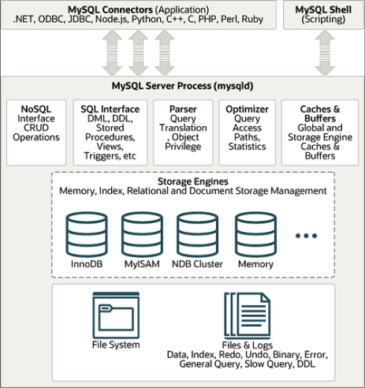

## SQL databases 
Since db works with disk we need to know how to optimize the work with it because it is one of the biggest thing wich can impact the performance. 

**MySql Architecture**

### Connection management and security 
For each connection, a seperated thread is allocated withing the server process. Amount of connections limits by the amount of open file descriptors on our server. Basically it is one of the easiest and obvious thing to improve.
The recommended optimal amount of connections can be calculated by formula: **(CPU * 2) - 1**. However, it is essential to tailor the configuration to your specific workload and monitor the database's performance to achieve optimal results.

In modern applications, connection pools manage database connections efficiently, reusing them instead of opening and closing them repeatedly. This can significantly change the effective number of connections required.

### Optimization and execution
MySQL parse queries to create an internal structure (execution plan) and then performs a number of optimizations. These include rewriting the query, determining the order in which tables are read, choosing which indexes to use, and so on.

MySQL optimizer works always as **greedy!** algorithm. He tries to use the least amount of resources on each operation. It means that for so difficult queries optimizer can make a mistake and choose not optimal query plan. To check query plan for we can use **explain** or **explain analyze**. We should always try to avoid use of difficult queries with not obvious use of indexes and tons of joins. 

Cashing for sql queiries in MySql doesn't work so well due to cache invalidation. Generally recomendation is to turn of mysql cache for not read heavy systems (amount of read operations significantlly bigger then amount of write operations). 

What is the difference between **explain** and **explain analyze**.
EXPLAIN calculated complexity based on the statistic without execution, while EXPLAIN ANALYZE execute query and show the statistic of real query execution. Also to get real statistic of query, make sens to add "no cache" key to query which should be explained to turn of use of cache. 

During examine of query pay attention to: FULL SCANS, usage of indexes, time of query execution. 

### Concurrent access management

MySQL itself, without store subsystems (InnoDB), purelly resolve issues of concurrent access control. Natively it propose only lock for read/writes on table level. Read locks are called shared locks and write locks is an exclusive locks. 
InnoDB provide locks on the portion of the resources that needs to be modified. 

The idea that with bigger selectiveness of locks, perfomance will be better. Minimizing the amount of resources you lock at any given time allows you to perform concurrent operations on the same object as long as those operations don't conflict with each other. Row locks are implemented by the storage subsystems, not by the server. The server knows nothing about the locks implemented by the storage subsystems, and all storage subsystems implement locks in their own way.

#### Transactions

#### Atomicity 
Entire transaction is either commited or cancelled.
#### Consistency 
The database must always transition from one consistent state to other. 
#### Isolation
Until transactions won't be commited the result of it **usually** not visible to other txs. 
#### Durability 
Once committed, the changes made during the transaction become permanent. 

The main advantage, in terms of perfomance for higload systems, of using transaction is that we can register a bunch of update/insert operations in one chunk (transaction). Due to Atomicity, when transaction will be commited, istead of rewriting and rebuilding index tree on each write/insert operation, index will be rebuilded only once, which gives a signifcant boost in perfomance on big amount of operations and data. Generally speaking, bulk upload will decrease load on CPU. 

### InnoDB optimization 
Since the disk is often the slowest component in a system, almost all of InnoDB optimizations revolve around disk handling.

#### InnoDB buffer pool size

`innodb_buffer_pool_size = 24G # InnoDB Engine buffer size`

If the database uses only InnoDB tables, set this value to the maximum possible for your system. The InnoDB buffer caches both data and indexes. Therefore, the value of this parameter should be set to **70% - 80%** of all available memory, if you have up to 32GB of memory, and **90% - 95%** - if more. 

Buffer stores in RAM, InnoDB tends to proccess queiries synchronously and stores data in memory, and latter asynchorously sync data to disk. 

`show variables like '%innodb_buffer_pool_size%';` will return current size of buffer in bytes. 
It means that when size of data in db will be more than pool_size value, operations will be uploaded directly to the disk. 
**Three the most common things which stores in buffer: temporar tables, caches and indexes.**

Check amount of I/O operations in monitor system, if this amount is growing it signals that we've reached the buffer pool size. And if usage of RAM, in monitor systems, reached some value, wich is less then the machine RAM memory size, it signals that we 've reached buffer size limit. The easiest and efficient solution will be to increase this limit. 

#### Redo logs

